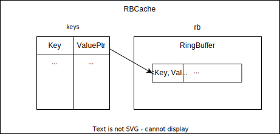

# cdn77_ukol - Recruit C++ envoy task

## TL;DR
Had a slow computer and a little time -> had to be creative.

## Table of content

- :question: [My thought process](#my-thought-process)
- :bulb: [Solution](#solution)
- :wrench: [Compiling and running](#compiling-and-running)
- :blue_book: [How-To](#how-to)
- :alarm_clock: [Timeline](#timeline)
- :exclamation: [Problems and challenges](#problems_and_challenges)

## My thought process
### Envoy itself
The studying of the Envoy itself took me a long time because I had to refresh and deepen my knowledge of the web dev. After a deep dive, I had a basic idea of where to put the cache - write my own HTTP filter. That's when I found an [article](https://tetrate.io/blog/wasm-modules-and-envoy-extensibility-explained-part-1/) that described the process of adding new extensions. In this article, the native C++ filters are described as: "This would require you to recompile Envoy and maintain your own version of it." and "You shouldn’t be maintaining your own version of Envoy just because of the filters you use.". I read somewhere else that the compilation of the Envoy takes an hour or so (I found out later that it is possible to compile the filter by itself but too late). Since I have a 2 core laptop, I've decided to find faster and easier way to extend Envoy to make at least some prototype for the interview. Conveniently, the article suggests the faster and easier way of creating filters - Wasm modules.
### HTTP filters
Since I learn best by examples and wanted the fastest way to implement at least some prototype, I found two sandboxes - [Cache filter](https://www.envoyproxy.io/docs/envoy/v1.30.4/start/sandboxes/cache) and [Wasm C++ filter](https://www.envoyproxy.io/docs/envoy/v1.30.4/start/sandboxes/wasm-cc) - which could be expanded to the functionality I need. After I read the article above, I thought that implement my own Cache filter would be too time consuming and therefore I took the path of the Wasm C++ filter. It had easy and uderstandable API and fast compilation time and I thought nice, this is the way. How wrong I was.
### Wasm C++ filter
The first thing I had to solve was where to put the actual cache. The `Context` is alive only during request lifecycle and `RootContext` is not accessible from the `Context` (at least I did not find a way). Hence, I created it as a global variable. I had to set `--concurrency 1` (1 worker thread) to at least implement the basic version of the cache because it behaved strangely with more threads. I realized later (too late, again) that each worker thread has its own copy of the cache - the Wasm module runs in the VM and each Envoy's worker thread has a copy of the VM and therefore its own copy of the cache. The multiple caches make request coalescing impossible because there needs to be one global cache for all requests, I presume.

After I collected and stored data correctly in the cache, I stumbled upon yet another problem. How to stop the whole filter chain when a request is already in the cache and return the cached value? Returning only `FilterHeadersStatus::StopIteration` or similar did not work, because it froze the filter chain and waited until the continue was called. So I almost lost the hope, that this path is the right one (which is not, I found out later) but after a deep dive into the [proxy-wasm Github repo](https://github.com/proxy-wasm/proxy-wasm-cpp-sdk/tree/main) I found a function called `sendLocalResponse()` that saved me. In combination with the return status it worked as I wanted. But as I mentioned above, it doesn't work as a shared cache for multiple worker threads because each worker thread has its own copy. With this knowledge the request coalescing is not possible. But there exist a Wasm service which runs on the main thread and can communicate with worker threads via Shared Memory or Message Queue. So this would be a good next step to explore.  

## Solution
The solution implements only the most basic cache, not the request coalescing (as it was reasoned in the [previous section](#wasm-c-filter) and because of the lack of time). The cache is implemented as an HTTP `envoy.filters.http.wasm` filter with the use of [proxy-wasm-cpp-sdk](https://github.com/proxy-wasm/proxy-wasm-cpp-sdk/tree/main) from the [Wasm C++ filter example](https://www.envoyproxy.io/docs/envoy/v1.30.4/start/sandboxes/wasm-cc). In `onRequestHeaders()` the cache is checked for the record, if the cache already contains the request, the response is sent from the cache by `sendLocalResponse()`, otherwise, a new record is created. A new record is created in `onRequestHeaders()` with a header and an empty body. `onResponseBody()` fills the body of the newest entry in the cache with the filled header and an empty body (this is correct because it is a ring buffer cache and there is only one thread manipulating with the cache). But this approach works only if the `onRequestHeaders()` and `onResponseBody()` methods are called one after the other - it is not crash-proof.

### Envoy config
There are 4 listeners listening on `localhost` on ports `8000, 8001, 8002, 8003`. All of them use the Wasm cache filter and are routed to the echo server. 

### Cache architecture
Cache uses FIFO policy due to the ring buffer implementation. The cache keys are stored in the map: <`Key`, `ValuePtr`>, `Key` - contains "Host" header and URL address of the request, `ValuePtr` - contains index into the ring buffer. I chose map as a separate data structure to store cache keys because the find is constant in the map. If there would be only a ring buffer, the find would be linear. And I assume that find is the most used function of the cache, therefore I optimized the cache for that. 

The ring buffer is implemented as a vector with elements as follows: <`Key`, `Value`>. The vector stores keys because the removing of the element is constant this way. If the vector would store only `Value`, the deletition of the element from the map would be linear. I assume that there is a lot of memory space to store the pairs in the vector and therefore I optimized for performance, not for memory utilization.

 

### Cache functionality
I implemented only the most basic cache - it implements only add and remove functionality so far, for demonstration purposes. It neither validate the records with the server nor removes them after some time. Records stay in the cache until they are evicted due to FIFO policy. The size of the cache is constant and there is only one ring buffer. There is no mutex since there is one cache per one worker thread and therefore the locking is not required because there is only one thread accessing the cache. The logging is done through LOG_WARN/LOG_INFO/... proxy-wasm interface into the console. The cache is easily extensible thanks to its abstraction and the logic.

### Cache summarization
The most important drawback is that the request coalescing is not implemented because in the current Wasm module approach it is not possible. Cache is not scalable for more threads because in the Wasm module architecture it is not necessary (again I see now, that it is not the correct approach). There is possibility to expand the cache for dynamic size and number of ring buffers. However I am not sure if the validation of the cache records is possible in this approach. The deletition of the elements after some period of time could be implemented. It has no security implemented but I don't think that it is necessary since there is only url and body of the web page stored. But if the content of the page would be associated with the client then the security might be needed. 

This is absolutely not ready for production due to reasons above but there might be a scenario in which this approach could be used (with tuning of the code - add security and dynamic size and number of ring buffers). For example, it would speed up client requests a little per worker thread. 

## Compiling and running
1. Clone the Envoy Github repository (version of the Envoy: v1.30.4):
```sh
git clone https://github.com/envoyproxy/envoy.git -b v1.30.4
```
2. Copy the `wasm-cache` directory into `envoy/examples/` directory and use `README.md` in the `wasm-cache` directory.
```sh
cp ./wasm-cache ./envoy/examples/
cd ./envoy/examples/wasm-cache
cat README.md
```

## How to
Check out the Test section in the `wasm-cache/README.md`.

## Timeline
| Day    | Topic     | 
| ------- | ------------ | 
| 16.7. (Tue)| Envoy documentation | 
| 17.7. (Wed)| Envoy documentation | 
| 18.7. (Thu)| Envoy documentation | 
| | Envoy sandboxes | 
| 19.7. (Fri)| Envoy sandboxes |
| 20.7. (Sat)| Setting up the environment |
| 21.7. (Sun)| Day off| 
| 22.7. (Mon)| Design & Implementation | 
| 23.7. (Tue)| Debug & Implementation | 
| 24.7. (Wed)| Documentation writing | 
| 25.7. (Thu)| Documentation writing | 

## Problems and challenges
The biggest challenge for me was to get into the Envoy itself and to find a place that is suitable for the cache implementation. Later in the implementation I had a challenge with stopping the filterchain and return the response right away.

There is not many commits in the git repository because most of the time I only read documentation and was trying demos and not implementing the actual cache.
