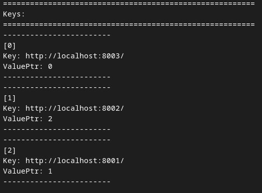
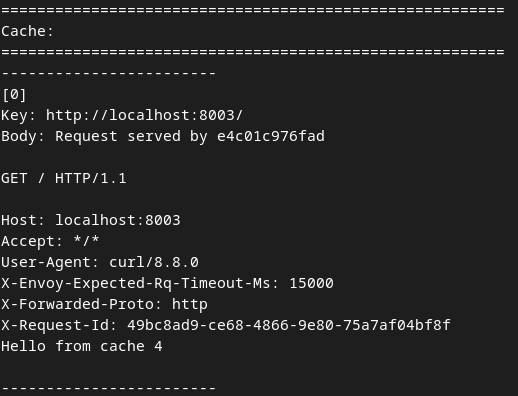
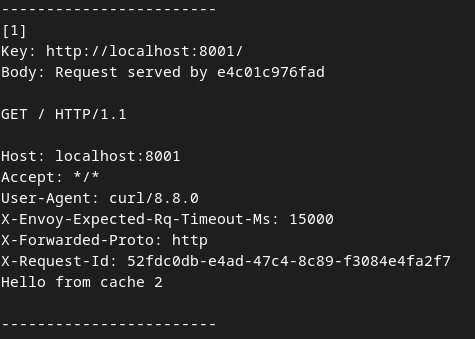
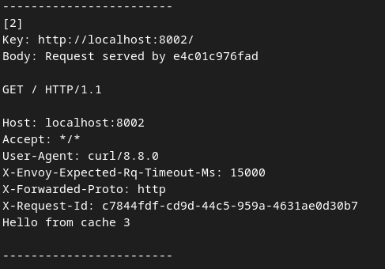

# Wasm Cache implementation
## Overview
- [Build & Run](#build--run)
- [Stop containers](#stop-containers)
- [Test](#test)
    - [Example test](#example-test)

## Build & Run
Follow the [Setup the sandbox environment](https://www.envoyproxy.io/docs/envoy/v1.30.4/start/sandboxes/setup) to set up the docker environment and then compile and run the `wasm-cache` project:
```sh
# Make sure you are in the correct directory
cd ./envoy/examples/wasm-cache/
# Compile the Wasm filter
rm -rf lib && sudo docker compose -f docker-compose-wasm.yaml up --remove-orphans wasm_compile
# Build and run the proxy container with the Wasm filter
sudo docker compose up --build proxy
# ...or run in the background
# sudo docker compose up --build -d proxy
```

## Stop containers
```sh
sudo docker compose stop
# Check running containers
sudo docker compose ps
```
## Test
Records in the cache have appended string at the of the body: "Hello from cache " + `req_counter`, `req_counter` is a global variable that is increased with every client request and therefore it is used to check that the body is returned from cache and stays the same for the whole duration of the record lifetime. If the body is returned from the server, not the cache, the string is missing.

To test that the bodies are returned from the cache you can repeatedly call the command below. First time, the body will be normal and the followed times the body will have the appended string at the end.
```sh
curl -s http://localhost:8000
```
Listeners listen on ports 8000, 8001, 8002, 8003 and the size of the ring buffer is 3.

The cache and keys map is dumped in the console each time the request is called so you can look at the console output and see how the cache is gradually filled with new records.

To test the FIFO policy, you can call the command above with all different ports and look at the cache in the log console output, as shown in the example below.  

### Example test
After running:
```sh
curl -s http://localhost:8000
curl -s http://localhost:8001
curl -s http://localhost:8002
curl -s http://localhost:8003
```
the Keys map and Cache with size 3 look like this:
 
|  | |

This example shows the circularity of the buffer (FIFO policy), where the fist request to localhost:8000 is replaced by the last request to localhost:8003. When you send request to any of the 8001/8002/8003 port, you will get a body with the corresponding "Hello from cache <`req_counter`>" at the end. But if you send request to port 8000 you will get body from the server without "Hello..." part and it will be cached at the index [1] of the cache.

```sh
# Served from cache
> curl -s http://localhost:8002
Request served by e4c01c976fad

GET / HTTP/1.1

Host: localhost:8002
Accept: */*
User-Agent: curl/8.8.0
X-Envoy-Expected-Rq-Timeout-Ms: 15000
X-Forwarded-Proto: http
X-Request-Id: c7844fdf-cd9d-44c5-959a-4631ae0d30b7
Hello from cache 3

# Served from server, not in the cache yet
> curl -s http://localhost:8000
Request served by e4c01c976fad

GET / HTTP/1.1

Host: localhost:8000
Accept: */*
User-Agent: curl/8.8.0
X-Envoy-Expected-Rq-Timeout-Ms: 15000
X-Forwarded-Proto: http
X-Request-Id: 21ecbdf8-f32c-458e-9503-2bd5e7c669fa
```
